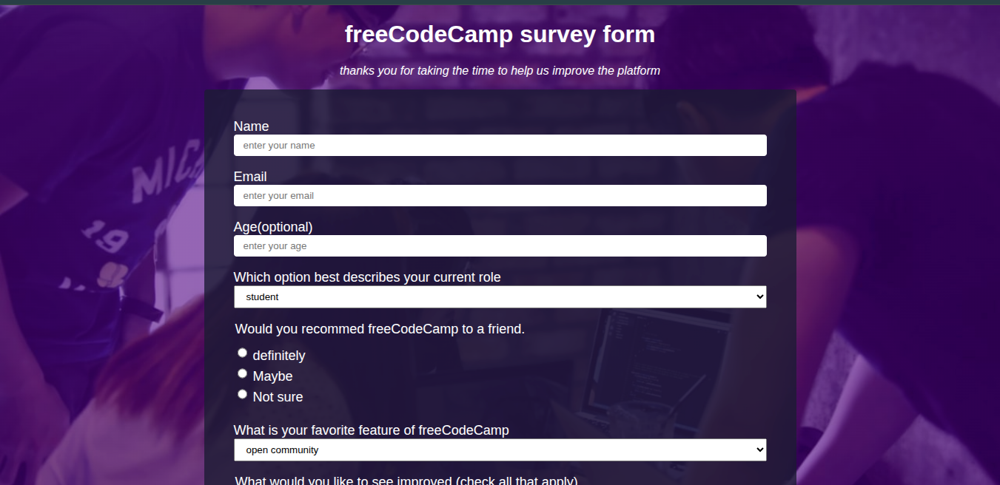

# 📊 Survey Form - FreeCodeCamp

An interactive survey form page designed for the FreeCodeCamp curriculum. This project collects user information and gathers personal feedback to help improve the platform.

---

## 📌 Problem Statement

How to build a structured and user-friendly interface to effectively collect overall user experience data and platform improvement suggestions?

---

## 🎯 Project Goals

- Build an interactive, clean, and accessible user interface.
- Ensure smooth data collection using various input types (text, radio buttons, checkboxes).
- Implement a fully responsive design that adapts seamlessly across all device screens.

---

## 🛠 Tech Stack

- **Frontend:** HTML5, CSS3 (Flexbox / Grid)
- **Version Control:** Git & GitHub

---

## 🖥 Features

- **Comprehensive Form:** Collects name, email, age, current role, and satisfaction levels.
- **Native Validation:** Uses HTML5 attributes for email formatting and mandatory field validation.
- **Responsive Layout:** Optimized visual experience on mobile, tablet, and desktop screens.

---

## 📷 Screenshots



---

## ⚙️ Installation & Setup

To clone and run this project locally, execute the following commands in your terminal:

```bash
# Clone the repository
git clone https://github.com/RusselFonta/Survey_form_html.git

# Navigate into the project directory
cd Survey_form_html

# Switch Branches to feature/survey_form_html if your are on the main branche
 git checkout feature/survey_form_html
```

---

## 🧠 Challenges Faced

- **Image Pathing:** Managing correct relative paths to display assets accurately within the document.
- **Form Tag Nuances:** Mastering semantic HTML5 structure, specifically binding `<label>` and `<input>` tags using the `for` attribute.
- **Code Architecture:** Organizing CSS style sheets efficiently to avoid redundancy and maintain clean code.

---

## 📚 What I Learned

- Advanced semantic web page structuring using HTML5.
- Core CSS styling principles including layout controls, typography, and spacing models.
- Essential project workflows using Git version control (commits, pushing to remote).

---

## 🚀 Future Improvements

- Integrate **JavaScript** to enable dynamic, real-time client-side input validation.
- Add smooth CSS transitions and animations upon form submission.
- Enhance accessibility features to meet WCAG / screen reader standards.

---

## 👨🏽‍💻 Author

**Russel Fonta Fadil**  
*Junior Fullstack Developer*  

- 📩 **Email:** fontawestbrook99@gmail.com  
- 🌍 **Location:** Cameroon (Open to remote opportunities)  
- 💼 **GitHub:** [RusselFonta](https://github.com/RusselFonta)